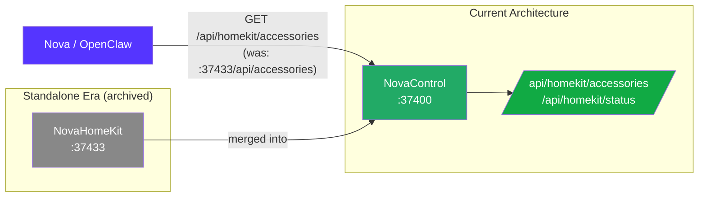
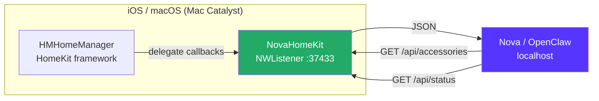

# NovaHomeKit

> **ARCHIVED** — HomeKit functionality has been merged into [NovaControl](https://github.com/kochj23/NovaControl) (`/api/homekit/*` routes). NovaHomeKit is no longer needed as a standalone app. This repo is preserved as a public historical reference.

---

Lightweight HomeKit query server for Nova. Exposes a local HTTP API on port 37433 so Nova can read your HomeKit accessories, scenes, and room layout without launching a full app or doing a network scan.

Runs as a headless macOS/Mac Catalyst background app — no UI, no menu bar icon. Nova queries it directly.

Written by Jordan Koch.


[](LICENSE)


---

## Migration: Merged into NovaControl

NovaHomeKit's full feature set has been absorbed into NovaControl as first-class `/api/homekit/*` routes. The standalone app is no longer required.



**Before (NovaHomeKit standalone):**
```bash
curl http://127.0.0.1:37433/api/accessories
curl http://127.0.0.1:37433/api/status
```

**After (NovaControl unified API):**
```bash
curl http://127.0.0.1:37400/api/homekit/accessories
curl http://127.0.0.1:37400/api/homekit/status
```

---

## Original Architecture



---

## API Endpoints

### `GET /api/accessories`

Returns all HomeKit accessories with room, service type, and characteristic values.

```json
[
  {
    "name": "Living Room Lights",
    "room": "Living Room",
    "services": [
      {
        "type": "Lightbulb",
        "characteristics": [
          { "type": "On", "value": true },
          { "type": "Brightness", "value": 80 }
        ]
      }
    ]
  }
]
```

### `GET /api/status`

```json
{ "status": "ok", "homes": 1, "accessories": 47 }
```

---

## How Nova Used It

NovaControl proxied NovaHomeKit through its unified API at port 37400. That proxy layer is now the canonical implementation — the standalone app is retired.

```bash
# Recommended (NovaControl — works today)
curl http://127.0.0.1:37400/api/homekit/accessories

# Legacy direct (only when NovaHomeKit was running)
curl http://127.0.0.1:37433/api/accessories
```

Nova queries the HomeKit API when she needs to:
- Report room temperatures and humidity
- Check lock states and door sensors
- Identify connected accessories for morning briefings
- Trigger scene execution via the Shortcuts CLI proxy

---

## Requirements

- iOS 16.0+ (iPhone) or macOS via Mac Catalyst
- HomeKit accessories configured in the Home app
- Running on the same Apple ID / iCloud account as your HomeKit home

---

## Installation

> **Note:** This app is archived. Use NovaControl (`/api/homekit/*`) instead.

Sideloaded via Xcode — not on the App Store.

```bash
cd /Volumes/Data/xcode/NovaHomeKit
xcodegen generate
open NovaHomeKit.xcodeproj
# Select target device and Run
```

The app starts `NWListener` on port 37433 (loopback only) immediately on launch and runs headlessly.

---

## Privacy & Security

- **Loopback only** — binds to `127.0.0.1:37433`, unreachable from other devices
- **Read-only** — queries HomeKit characteristics, never writes
- **No cloud** — direct HMHomeManager API, all on-device
- **No UI** — headless background process

---

## License

MIT License — see [LICENSE](LICENSE).

Written by Jordan Koch ([@kochj23](https://github.com/kochj23))
